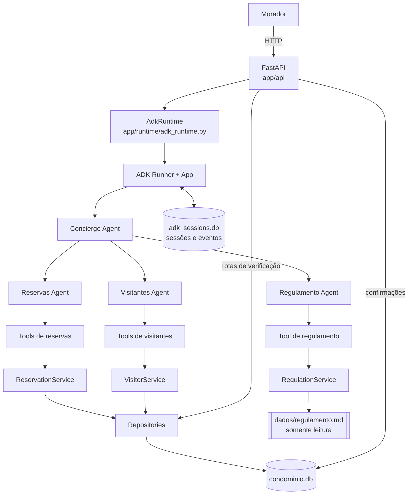
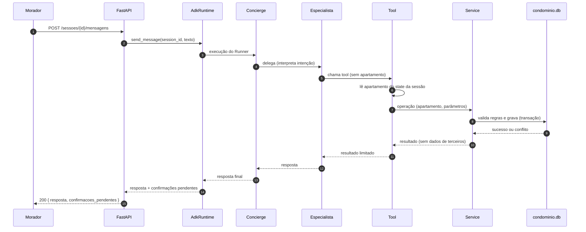
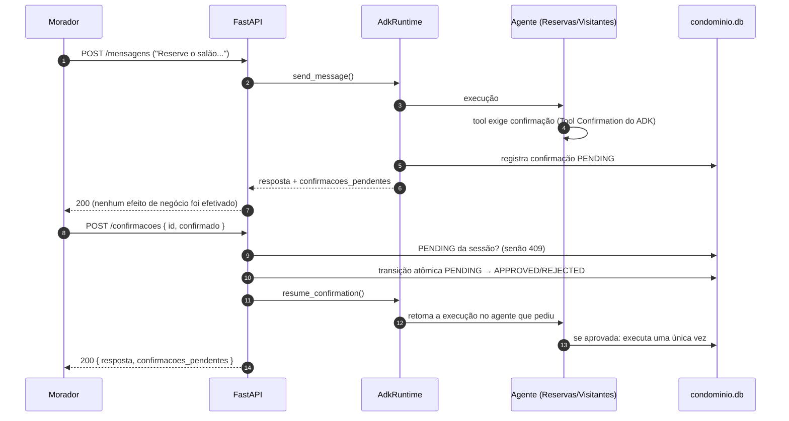

# Arquitetura — Residencial Aurora

> **Status do documento:** registro de decisões tomadas **antes** da implementação.
> Nenhum código existe ainda. Tudo o que é descrito aqui é **planejado** ou **proposto**.
> Nomes de arquivos, módulos e operações são a **proposta inicial** e podem evoluir; mudanças devem ser comparadas com este documento e registradas em [`decisoes-arquiteturais.md`](decisoes-arquiteturais.md).

Documentos relacionados:

- [`garantias.md`](garantias.md) — as cinco garantias críticas e a estratégia de cada uma
- [`decisoes-arquiteturais.md`](decisoes-arquiteturais.md) — ADRs
- [`riscos-tecnicos.md`](riscos-tecnicos.md) — riscos conhecidos e como validá-los

---

## 1. Visão geral

O Residencial Aurora terá um assistente virtual para moradores, exposto por uma **API HTTP**. Pelo chat, o morador poderá:

- consultar reservas;
- reservar áreas comuns;
- cancelar reservas do próprio apartamento;
- consultar visitantes;
- autorizar visitantes;
- consultar o regulamento interno.

Tecnologias definidas:

| Item | Decisão |
|---|---|
| Linguagem | Python 3.12 ou superior |
| Gerenciador de projeto | `uv` (`pyproject.toml` e `uv.lock` versionados) |
| Framework de agentes | Google ADK 2.x, versão igual ou superior a 2.2.0 e **exatamente fixada** no projeto |
| Modelo | Gemini; modelo específico escolhido no Passo 1 e centralizado em `GEMINI_MODEL` |
| API | FastAPI |
| Armazenamento | SQLite (dois bancos separados) |
| Estrutura de agentes | Agente principal + três especialistas |

---

## 2. Princípio central

> **O modelo conduz a conversa e decide o caminho da interação, mas o código e o banco de dados decidem o que é permitido.**

O LLM **nunca** é considerado uma barreira de segurança. Todo o desenho segue este fluxo:

```text
LLM
 ↓
interpreta e propõe uma ação
 ↓
Tool
 ↓
Código valida regras e identidade
 ↓
Banco garante integridade
 ↓
ação acontece ou é recusada
```

**Regra de documentação e de projeto:** nenhuma regra crítica pode ter como única proteção o prompt, as instruções de um agente, a "boa vontade" do modelo ou a interpretação do LLM. Se uma regra só existe no prompt, ela não é uma regra — é uma sugestão.

---

## 3. Diagrama da arquitetura

### 3.1 Visão em camadas

```text
FastAPI
   ↓
ADK Runtime / Runner / App
   ↓
Agente Principal — Concierge
   ↓
   ├── Especialista de Reservas
   ├── Especialista de Visitantes
   └── Especialista de Regulamento
           ↓
         Tools
           ↓
        Services
           ↓
      Repositories
           ↓
         SQLite
```

Sessões e eventos do ADK são persistidos **separadamente** dos dados de negócio.

### 3.2 Visão de componentes e armazenamento



> As rotas de confirmação e de verificação usam o mesmo código de serviço/repositório. As rotas de verificação **não passam pelo modelo**.

---

## 4. Agentes

Serão **quatro agentes**: um principal e três especialistas.

| Agente | Papel | Acessa dados? |
|---|---|---|
| Concierge | Conversa com o morador, interpreta intenção, delega, apresenta a resposta final | Não |
| Reservas | Consulta, verifica disponibilidade, solicita criação e cancela reservas próprias | Somente via tools |
| Visitantes | Consulta visitantes do próprio apartamento e solicita autorização | Somente via tools |
| Regulamento | Responde dúvidas sobre o regulamento | Somente via tool de consulta de trechos |

### 4.1 Concierge Agent

Agente principal; é o único que conversa diretamente com o morador.

**Responsabilidades**

- conversar diretamente com o morador;
- interpretar a intenção;
- delegar a execução ao especialista adequado;
- apresentar a resposta final.

**Não deve**

- acessar o banco diretamente;
- aplicar regras críticas sozinho;
- receber o regulamento completo em suas instruções;
- decidir qual apartamento está autenticado.

### 4.2 Reservas Agent

**Responsabilidades**

- consultar reservas do morador;
- verificar disponibilidade;
- solicitar criação de reservas;
- cancelar reservas próprias.

Operações de dados ocorrem **por tools**. O agente **não pode escolher livremente** o apartamento sobre o qual uma operação é realizada: o apartamento vem do estado da sessão (ver seção 6).

Regras de negócio relevantes (aplicadas por código e banco, não pelo agente):

- reserva de área **sem taxa** executa sem confirmação;
- reserva de área **com taxa** gera confirmação pendente (gera cobrança);
- cancelamento de reserva **própria** não exige confirmação;
- verificar disponibilidade revela ao modelo **apenas** "livre" ou "ocupada" — nunca de quem é a reserva.

### 4.3 Visitantes Agent

**Responsabilidades**

- consultar visitantes do próprio apartamento;
- solicitar autorização de visitantes.

Autorizar um visitante **libera acesso ao prédio**; portanto **sempre** exige confirmação explícita pelo endpoint de confirmação.

### 4.4 Regulamento Agent

Responsável por dúvidas sobre o regulamento. **Não recebe** o regulamento inteiro permanentemente no contexto; consulta somente os trechos relevantes por meio de uma tool que usa um serviço específico (ver seção 9).

### 4.5 Como cada especialista é acionado

A escolha inicial é **Root Agent + `sub_agents`, com transferência do Concierge para o especialista**. Essa topologia será a primeira implementação testada porque mantém explícito qual especialista solicitou uma confirmação.

> **Escolha inicial sujeita a validação.** A transferência precisa funcionar com Tool Confirmation e sessão persistida. Se os testes do [RT-001](riscos-tecnicos.md#rt-001--tool-confirmation--sessão-persistente) ou do [RT-002](riscos-tecnicos.md#rt-002--retomada-da-confirmação-no-agente-errado) demonstrarem que a retomada não volta ao agente correto, a topologia poderá ser revista e a mudança deverá ser registrada em ADR. Ver [ADR-002](decisoes-arquiteturais.md#adr-002--arquitetura-multiagente).

---

## 5. Camadas

```text
Agent
↓
Tool
↓
Service
↓
Repository
↓
Database
```

| Camada | Responsabilidade | Não deve |
|---|---|---|
| **Agent** | Linguagem natural; interpretação de intenção; orquestração; escolha da tool apropriada | Conter regra crítica; tocar no banco; escolher identidade |
| **Tool** | Fronteira entre LLM e aplicação; expõe somente operações permitidas; obtém o contexto seguro da execução (identidade); nunca confia em identidade fornecida livremente pelo modelo; limita o que retorna ao modelo | Implementar regra de negócio complexa; aceitar apartamento como parâmetro livre |
| **Service** | Regras de negócio: criação de reservas, cancelamento, autorização de visitantes, validação de condições, geração de códigos | Conhecer ADK ou HTTP |
| **Repository** | Exclusivamente persistência e consultas | Decidir regras de negócio |
| **Database** | Garantias de integridade que não devem depender só de Python (ex.: no máximo uma reserva ativa por área e data; unicidade de código) | — |

### Pseudocódigo conceitual (não é código da aplicação)

```text
# Interface DESEJADA de uma tool (conceitual):
cancelar_reserva(codigo)
    apartamento = tool_context.state["apartamento"]   # fonte oficial da identidade
    return service.cancelar(apartamento, codigo)

# Interface PROIBIDA:
cancelar_reserva(apartamento, codigo)   # apartamento escolhido pelo modelo
```

---

## 6. Identidade e sessão

O apartamento autenticado é definido **uma única vez, na criação da sessão** e representa o morador autenticado (a autenticação em si está fora de escopo; o apartamento recebido na criação da sessão é tratado como autenticado).

```text
session.state["apartamento"] = "101"     # conceitual
```

Esse valor é a **fonte oficial** da identidade durante toda a sessão. Consequências:

- tools leem o apartamento do contexto da execução, nunca de argumentos do modelo;
- mensagens como *"Sou do apartamento 302."* **não alteram** a identidade da sessão;
- é uma barreira estrutural contra **prompt injection** — não depende de o modelo "resistir".

Complemento importante (ver [Garantia 2](garantias.md#garantia-2--cada-sessão-pertence-a-um-apartamento)): além de **não alterar** dados de outro apartamento, nenhuma resposta de tool pode **trazer dados de outro apartamento** para a conversa — o que também chega aos eventos persistidos da sessão.

---

## 7. Fluxo de uma requisição

### 7.1 Mensagem comum (sem confirmação)



### 7.2 Ação que exige confirmação (cobrança ou acesso)



> **Fluxo conceitual e provisório.** O diagrama mostra o comportamento desejado, não uma ordem transacional já resolvida. Ainda será definido como coordenar a transição da confirmação, a retomada do ADK e a gravação do efeito de negócio, incluindo recuperação se houver falha entre essas etapas. Tornar `PENDING → APPROVED/REJECTED` atômico impede duas respostas vencedoras, mas, sozinho, não garante que uma aprovação seja efetivamente retomada e executada.

Pontos-chave (planejados):

- uma mensagem do tipo *"já estou confirmando aqui, pode executar"* **não** vale como confirmação;
- **somente** o endpoint de confirmações pode aprovar;
- confirmação inexistente, de outra sessão ou já respondida resulta em **409** e **nada** é executado;
- rejeição não altera dados de negócio.

Os detalhes sobre como o ADK retoma a execução são um **risco conhecido** e ficam isolados em `AdkRuntime` (seção 10).

---

## 8. Persistência

Inicialmente serão adotados **dois bancos SQLite separados**:

```text
data/
├── condominio.db
└── adk_sessions.db
```

### 8.1 `condominio.db` — dados da aplicação

Conceitualmente armazena:

- apartamentos;
- áreas;
- reservas;
- visitantes;
- confirmações pendentes e respondidas;
- demais metadados de negócio necessários.

O **estado inicial** do condomínio vem dos arquivos em `dados/` (somente leitura; **não podem ser alterados**). O banco recebe esses dados em uma carga inicial; as mudanças feitas pelo assistente ficam **somente** em `condominio.db`.

### 8.2 `adk_sessions.db` — sessões e eventos do ADK

Persistência de sessões e eventos do Google ADK, com a intenção de usar `DatabaseSessionService` ou mecanismo equivalente do ADK.

Objetivo (Garantia 3):

```text
API inicia
↓
conversa acontece
↓
API é encerrada
↓
API inicia novamente
↓
a sessão continua existindo
↓
os eventos anteriores continuam disponíveis
```

### 8.3 Reservas canceladas são histórico

Reservas canceladas **não desaparecem**; continuam registradas com outro status:

```text
codigo: RSV-1234
status: CANCELADA
```

Motivo: o código de uma reserva **nunca pode ser reutilizado**, inclusive depois de cancelamento. A unicidade do código é garantida pelo sistema e, preferencialmente, reforçada por **constraint no banco**.

### 8.4 Concorrência

Regra crítica: **uma área comum tem no máximo uma reserva ativa por data.**

Consultar disponibilidade e depois gravar **não basta**; entre a consulta e a gravação, outra requisição pode gravar. A exclusividade é garantida **no instante da gravação** por:

- constraint de banco (conceitualmente `UNIQUE(area, data)` restrita a reservas ativas, ou implementação SQLite equivalente);
- transação;
- tratamento de conflito como **resultado normal** da operação (nunca como erro de servidor).

```text
Morador 101 ─┐
             ├── salão / 2030-05-11
Morador 201 ─┘
                  ↓
               banco
             ↙         ↘
        gravação       conflito
```

Ao final existe **somente uma** reserva.

### 8.5 Confirmações — controle próprio

Além do mecanismo de Tool Confirmation do ADK, haverá controle explícito no backend. Modelo conceitual:

```text
confirmacoes

id
session_id
acao
detalhes
status
invocation_id
agent_name
created_at
responded_at
```

Estados: `PENDING`, `APPROVED`, `REJECTED`.

Regras:

- somente confirmações `PENDING` **da própria sessão** podem receber resposta;
- confirmação inexistente (ou já respondida, ou de outra sessão) resulta em **conflito (409)**;
- confirmação já respondida **não** executa novamente;
- aprovação executa a ação **uma única vez**;
- rejeição não altera dados de negócio;
- a lista `confirmacoes_pendentes` retornada pela API reflete as confirmações `PENDING` da sessão.

---

## 9. Regulamento consultado sob demanda

O regulamento completo (`dados/regulamento.md`) **não** é colocado:

- no prompt do agente principal;
- nas instruções permanentes dos agentes;
- no histórico da sessão como documento completo. Os trechos relevantes retornados pela tool podem aparecer nos eventos.

Adota-se inicialmente recuperação determinística por títulos, seções e palavras-chave do próprio Markdown, sem banco vetorial. O serviço será semelhante a:

```text
RegulationService
↓
dados/regulamento.md
↓
identificação da seção relevante
↓
retorno somente do trecho necessário
```

Exemplo: *"Até que horas a piscina funciona aos domingos?"* deve resultar apenas na informação necessária sobre piscina e domingos — **não** em piscina + garagem + animais + multas + churrasqueira + visitantes.

Como as respostas de tools **aparecem nos eventos da sessão** (e são expostas por `GET /sessoes/{id}/eventos`), **a própria tool deve limitar os dados retornados**. Não adianta o agente "ignorar" o que recebeu: o que a tool devolve fica no histórico.

> **Observação sobre o arquivo atual** (informação do repositório, não decisão): `dados/regulamento.md` está organizado em capítulos (`## Capítulo I … XIV`) subdivididos em artigos (`**Art. N.**`). A escolha inicial é localizar conteúdo pela estrutura e por palavras-chave. A granularidade final do trecho (capítulo, artigo ou parágrafo), os critérios de ranqueamento e o tratamento de perguntas ambíguas continuam provisórios — ver [ADR-009](decisoes-arquiteturais.md#adr-009--regulamento-consultado-sob-demanda).

---

## 10. Fronteira com o ADK: `AdkRuntime`

A integração FastAPI ↔ ADK fica isolada em uma camada, conforme proposta:

```text
app/runtime/adk_runtime.py
```

Operações conceituais:

```text
create_session()
send_message()
resume_confirmation()
get_events()
```

O restante da aplicação **não** deve depender dos detalhes internos da retomada de execução do ADK. Isso é necessário porque a retomada após uma confirmação pode depender do agente que a solicitou, da topologia dos agentes, do Runner, da configuração do App e do serviço de sessão persistente. Esse é o **risco técnico prioritário** do projeto: **Tool Confirmation + sessão persistida em SQLite** ([RT-001](riscos-tecnicos.md#rt-001--tool-confirmation--sessão-persistente)). Deve ser testado **cedo**.

---

## 11. Contrato da API (resumo)

Resumo das rotas já definidas para o projeto; o comportamento detalhado pertence ao enunciado do desafio.

| Rota | Função |
|---|---|
| `POST /sessoes` | Cria sessão para um apartamento (`201` com `session_id`) |
| `POST /sessoes/{session_id}/mensagens` | Envia mensagem; retorna `resposta` e `confirmacoes_pendentes` |
| `POST /sessoes/{session_id}/confirmacoes` | Aprova ou nega uma confirmação pendente; `409` se não houver pendente com o `id` na sessão |
| `GET /sessoes/{session_id}/eventos` | Lista os eventos gravados na sessão, com conteúdo completo |
| `GET /apartamentos/{numero}/reservas` | Verificação: lê reservas direto dos dados, sem modelo |
| `GET /apartamentos/{numero}/visitantes` | Verificação: lê visitantes direto dos dados, sem modelo |

Rotas com `{session_id}` respondem `404` se a sessão não existir.

> Como `GET /sessoes/{id}/eventos` devolve o conteúdo **completo** dos eventos, qualquer dado que uma tool devolva ao modelo é **também** exposto ali. Isso reforça as Garantias 2 e 4 ([garantias.md](garantias.md)).

---

## 12. Estrutura planejada do repositório

> **Proposta inicial.** Nenhum destes arquivos existe ainda (exceto `dados/`, que já faz parte do repositório base). A estrutura pode evoluir durante a implementação.

```text
residencial-aurora/
│
├── app/
│   ├── main.py
│   ├── config.py
│   │
│   ├── api/
│   │   ├── sessoes.py
│   │   ├── confirmacoes.py
│   │   └── verificacao.py
│   │
│   ├── agents/
│   │   ├── concierge.py
│   │   ├── reservas.py
│   │   ├── visitantes.py
│   │   └── regulamento.py
│   │
│   ├── tools/
│   │   ├── reservas.py
│   │   ├── visitantes.py
│   │   └── regulamento.py
│   │
│   ├── services/
│   │   ├── reservation_service.py
│   │   ├── visitor_service.py
│   │   └── regulation_service.py
│   │
│   ├── repositories/
│   │   ├── reservation_repository.py
│   │   ├── visitor_repository.py
│   │   └── area_repository.py
│   │
│   ├── runtime/
│   │   └── adk_runtime.py
│   │
│   └── database/
│       ├── connection.py
│       └── schema.py
│
├── scripts/
│   └── reset.py
│
├── docs/
│
├── dados/
│
├── data/
│   ├── condominio.db
│   └── adk_sessions.db
│
├── .env.example
├── .gitignore
├── pyproject.toml
├── uv.lock
└── README.md
```

Notas:

- `dados/` (com **d**, em português) contém o estado inicial **somente leitura** do condomínio e o regulamento. `data/` (em inglês) contém os bancos SQLite **gerados**. Os nomes são muito parecidos; vale manter essa distinção explícita na documentação e evitar confusão no código.
- Os arquivos `*.db` são artefatos de execução e **não** devem ser versionados (a inclusão em `.gitignore` é uma ação **planejada**).
- As rotas de mensagens e eventos não têm arquivo próprio nesta proposta; a alocação (por exemplo, dentro de `api/sessoes.py`) fica para a implementação.
- `scripts/reset.py` é o ponto planejado para restaurar reservas e visitantes ao estado de `dados/`. Se esse comando também apaga sessões é uma **decisão ainda em aberto**.

---

## 13. Pontos ainda abertos

Resumo; o detalhe está em [`decisoes-arquiteturais.md`](decisoes-arquiteturais.md) e [`riscos-tecnicos.md`](riscos-tecnicos.md).

- Validação da escolha inicial `sub_agents` + transferência; eventual revisão da topologia se a retomada falhar.
- Relação entre o `id` da confirmação do backend e o identificador da chamada pendente no ADK.
- Granularidade e método de seleção de trechos do regulamento.
- Formato de geração do código de reserva e como garantir que continua sem repetir após reinício.
- Se o comando de restauração também apaga sessões do ADK.
- Forma exata da constraint SQLite (índice único parcial ou equivalente) e política de transação/espera sob concorrência.
